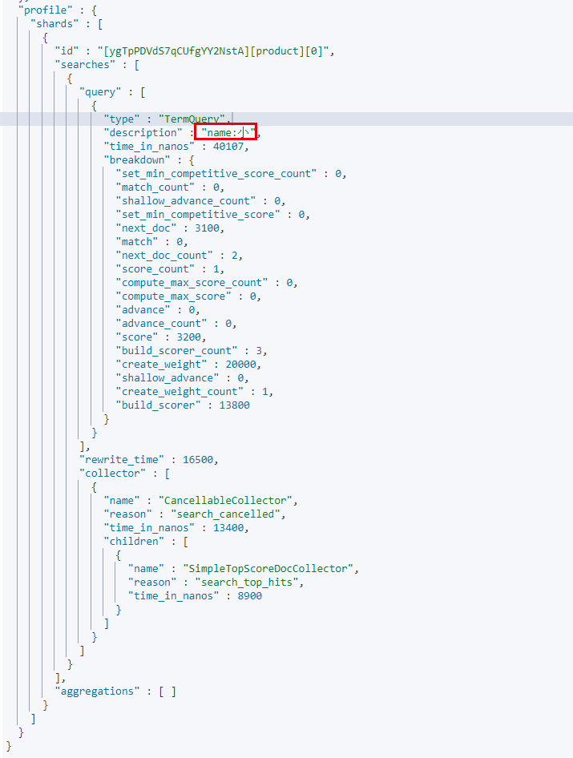
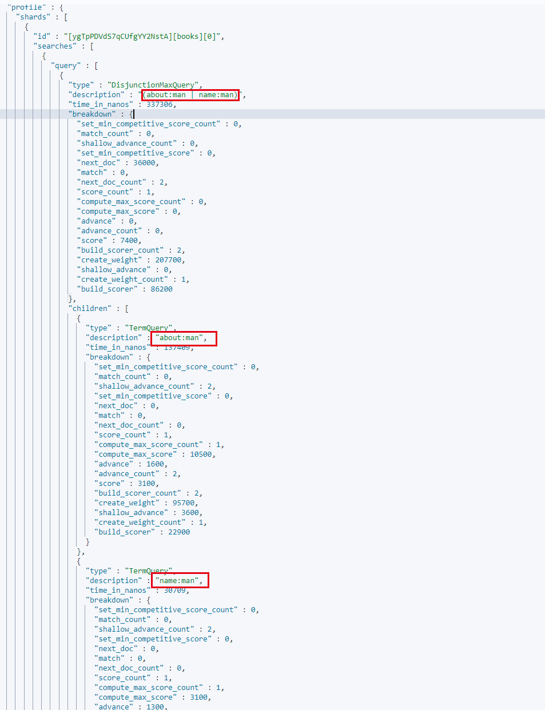

### 查询两个字段都有的数据

#### 问题

```
为什么下面语句可以查询出数据   %E5%B0%8F：小
GET product/_search?q=%E5%B0%8F&df=title&df=name

POST product/_create/1
{
	"name":"小西红柿",
    "title":"又大又红的西红柿"
}
=================================================

英文就查询不出来
POST books/_search?q=the&df=name&df=about

POST books/_create/1
{
  "name":"The Old Man and the Sea",
  "about":"I like this old man"
}


```

#### 探索之路

```
POST books/_search?q=like&df=name&df=about
{
  "profile": "true"
}
```

通过使用 **profile** 查看查询计划，只有最后一个df被执行查询



使用 Request Body Search 查询

```
POST books/_search
{
  "query": {
    "multi_match": {
      "query": "man",
      "fields": ["name","about"]
    }
  },  "profile": "true"
}
```

发现两个条件都执行了，但是使用的是 **或**



#### 猜测

使用URI查询的时候 **&df** 语法有问题或者不支持多字段